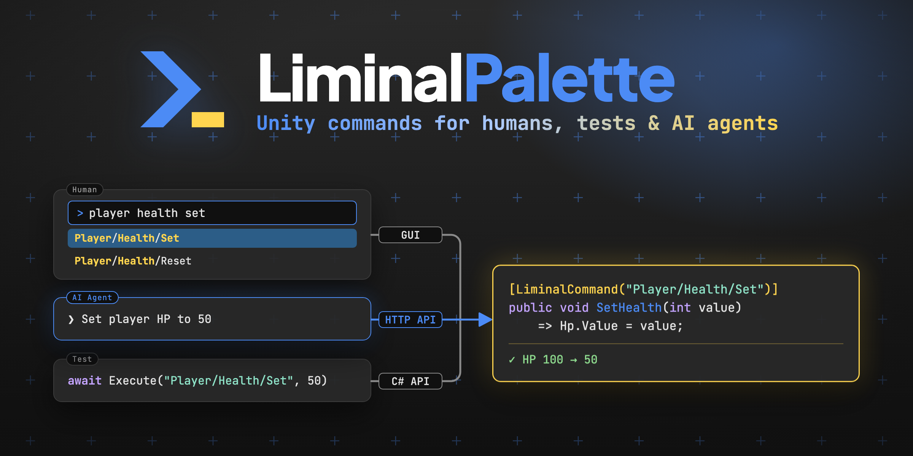

<p align="center">
  
</p>

<p align="center">
  <a href="https://github.com/void2610/liminal-palette/blob/main/package.json"></a>
  <a href="https://unity.com/releases/editor/whats-new/6000.3"></a>
  
  
  <a href="LICENSE.md"></a>
</p>

<p align="center">
  <a href="Documentation~/ipc.md"></a>
  <a href="#ai-agent-連携-claude-code-skills"></a>
  <a href="Documentation~/scenarios.md"></a>
  <a href="CHANGELOG.md"></a>
  <a href="https://github.com/void2610/liminal-palette/stargazers"></a>
</p>

<p align="center">
  <b>VS Code のコマンドパレット風 UI を持つ、Unity 用のデバッグコンソール / コマンド実行ライブラリ。</b><br>
  <code>[LiminalCommand]</code> を付けた C# メソッドを、<b>人間 (GUI) / AI Agent (HTTP API) / テスト (C# API)</b> の 3 経路から同じ名前で実行できる。
</p>

<p align="center">
  <a href="#クイックスタート-4-ステップ">クイックスタート</a> ·
  <a href="#3-つの入り口">3 つの入り口</a> ·
  <a href="#できること">できること</a> ·
  <a href="#インストール">インストール</a> ·
  <a href="#ドキュメント">ドキュメント</a>
</p>

---

## 3 つの入り口

コマンドを 1 回書けば、ヒーロー画像の 3 経路すべてから同じ `Player/Health/Set` が呼べる。

| 入り口 | 誰が使う | どう呼ぶ |
|---|---|---|
| **GUI** | 人間 | `Cmd/Ctrl + K` でパレットを開き、ファジー検索 → 引数入力 → Run。Editor / Play Mode の両方で動く |
| **HTTP API** | AI Agent / CLI / Discord bot | `curl -X POST /api/v1/execute` 一発。Claude Code 向け Agent Skills と `liminal` CLI を同梱 |
| **C# API** | テスト / CI | `[LiminalScenario]` でコマンドチェインを宣言し、Unity Test Runner や `liminal run` から実行 |

```csharp
[LiminalCommand("Player/Health/Set")]
public void SetHealth(int value) => Hp.Value = value;
```

```bash
# AI Agent / CLI から
curl -s -H "Authorization: Bearer $TOKEN" -H "Content-Type: application/json" \
     -X POST http://127.0.0.1:7610/api/v1/execute \
     -d '{"path":"Player/Health/Set","args":{"value":"50"}}'
```

```csharp
// テストから
[UnityTest]
public IEnumerator Run([ValueSource(nameof(Paths))] string path)
    => LiminalPaletteTestRunner.RunScenario(path);
```

---

## できること

- **ファジー検索付きコマンドパレット** (Editor / Runtime 両対応、UI Toolkit 製)
- **4 タブ構成**: Command (新規実行) / Scenario (コマンドチェイン実行) / Log (起動履歴の詳細閲覧) / History (再実行特化)。`Tab` / `Shift+Tab` でタブ巡回
- **型解決済み引数 UI**: `int` / `float` / `string` / `bool` / `enum` / `Vector2/3/4` / `Color` / `[Flags] enum` / `UnityEngine.Object` 派生
- **観測フィールド**: `[LiminalObservableField]` を付けた `ReactiveProperty<T>` の現在値を UI に常時表示。R3 push 駆動で自動更新
- **シナリオ (統合テスト)**: `[LiminalScenario]` で「スポーン → ダメージ → HP を Assert」のようなチェインを C# で宣言。`Scene` / `ReadyWhen` / `TimeScale` / `Setup` 属性でボイラープレートを削減
- **HTTP API**: localhost で `/api/v1/{health, commands, execute, logs, state, scenarios, scenarios/run, tests/run, tests/result}` を提供。Bearer トークン認証 + レートリミット
- **CLI `liminal`**: 依存ゼロの Python シングルファイル。`liminal run 'Battle/*' --report junit.xml` で CI からシナリオ実行、`liminal test playmode` で Unity Test Runner を起動
- **AI Agent 連携**: Claude Code 向け Agent Skills を 8 個同梱。メニュー 1 つで利用側プロジェクトへインストール
- **Production ビルド除外**: `defineConstraints` の三重防御で Player ビルドにシンボル混入なし
- **拡張点**: `ITypeConverter` / `IParameterEditor` / `ICommandHistory` で利用側が拡張可能

---

## クイックスタート (4 ステップ)

### 1. コマンドを書く

```csharp
using R3;
using UnityEngine;
using Void2610.LiminalPalette;

public class Player : MonoBehaviour
{
    public ReactiveProperty<int> Hp { get; } = new(100);

    [LiminalObservableField("Player/Health")]
    public ReactiveProperty<int> HpField => Hp;          // 現在値が UI に常時表示される

    [LiminalCommand("Player/Health/Set", Description = "プレイヤーの HP を設定する")]
    public void SetHealth(int value) => Hp.Value = value;  // インスタンスメソッドでも OK
}
```

### 2. VContainer に登録

```csharp
public class GameLifetimeScope : LifetimeScope
{
    protected override void Configure(IContainerBuilder builder)
    {
        builder.RegisterComponentInHierarchy<Player>();
        builder.RegisterEntryPoint<LiminalPaletteEntryPoint>();   // 1 行で接続完了
    }
}
```

### 3. パレットを開いて実行

- **Editor**: `Cmd/Ctrl + K` でパレットを開き、"Player Set" などで検索 → 引数欄上部に現在 HP が表示 → Run で実行。
- **Play Mode** (ゲーム実行中): 同じ `Cmd/Ctrl + K` で半透明 overlay として開く。値は R3 push 駆動で自動更新。

### 4. HTTP API で叩く (任意)

```bash
TOKEN=$(cat ~/.liminal-palette/token)

curl -s -H "Authorization: Bearer $TOKEN" \
     -H "Content-Type: application/json" \
     -X POST http://127.0.0.1:7610/api/v1/execute \
     -d '{"path":"Player/Health/Set","args":{"value":"100"}}'
# → {"success":true,"value":null,"durationMs":0.51,...}
```

トークンは Editor 起動時に `~/.liminal-palette/token` へ自動生成される。CLI なら `liminal exec Player/Health/Set value=100` で同じことができる ([liminal-cli](https://github.com/void2610/liminal-cli))。

---

## シナリオでテストする

`[LiminalScenario]` を付けたメソッドが `ScenarioStep` を `yield return` すると、Scenario タブ / HTTP API / Unity Test Runner の全経路から同じチェインを実行できる。

```csharp
[LiminalScenario("Combat/EnemyTakesDamage", Scene = "Battle", ReadyWhen = "Game/State=InBattle")]
public static IEnumerable<ScenarioStep> EnemyTakesDamage()
{
    yield return ScenarioStep.Run("Enemy/Spawn", new() { ["type"] = "Goblin" });
    yield return ScenarioStep.AssertEquals("Enemy/Hp", 100);
    yield return ScenarioStep.Run("Enemy/Damage", new() { ["amount"] = 30 });
    yield return ScenarioStep.AssertEventually("Enemy/Hp", 70, timeoutSeconds: 2f);
}
```

| 実行方法 | 使いどころ |
|---|---|
| Scenario タブ → **Run Scenario** | 手元で再現手順を 1 クリック再生 |
| `liminal run 'Combat/*' --report junit.xml` | CI から HTTP 経由で一括実行。JUnit XML で結果を集計 |
| `LiminalPaletteTestRunner.RunScenario(path)` | Unity Test Runner の `[UnityTest]` に載せて parametrized test 化 |
| `POST /api/v1/tests/run` / `liminal test playmode` | Unity Test Runner 自体を外部から起動して結果を polling |

詳細は [scenarios](Documentation~/scenarios.md) を参照。

---

## AI Agent 連携 (Claude Code Skills)

Claude Code から HTTP API を叩くための **Agent Skills** を package に同梱している。利用側プロジェクトを Unity で開いた状態で:

```
Tools > LiminalPalette > Install AI Skills...
```

を選ぶと、プロジェクトルートの `.claude/skills/` に 8 個の `liminal-*` skill (liminal-overview / liminal-find-port / liminal-list-commands / liminal-execute / liminal-get-state / liminal-get-logs / liminal-list-scenarios / liminal-run-scenario) がコピーされる。Claude Code を再起動すれば skill が認識され、「LP のコマンド一覧」「Player/Health/Set を 50 で実行」のような指示で curl 操作が自動選択される。

アンインストール: `Tools > LiminalPalette > Uninstall AI Skills`。

skill ファイル本体は package 内の `AISkills~/` に同梱されており、上書きインストールで常に LP の最新版に同期する。

---

## 動作要件

| 項目 | 要件 |
|---|---|
| Unity | **6000.3** 以降 (UI Toolkit Runtime support 利用) |
| 言語 | .NET Standard 2.1 / C# 9 以降 |
| 入力 | Legacy Input Manager / Input System Package のどちらでも動く (両方有効でも可) |
| [R3](https://github.com/Cysharp/R3) | 必須。`ReactiveProperty<T>` / `Observable<T>` 対応 |
| [VContainer](https://github.com/hadashiA/VContainer) | 必須。インスタンスメソッドコマンドの解決 |
| [UniTask](https://github.com/Cysharp/UniTask) | 必須。`UniTask` / `UniTask<T>` 戻り値コマンドの await |
| [LitMotion](https://github.com/annulusgames/LitMotion) | 任意。導入時のみ `Anim/CompleteAll` / `Anim/CancelAll` コマンドが有効化 |
| Test Framework | 任意。導入時のみ `/api/v1/tests/*` と `LiminalPaletteTestRunner` が有効化 |

> Phase 4 までは外部依存ゼロだったが、Phase 5a で R3 + VContainer 必須に方針転換した。利用側のコード量を最小化する設計判断。

---

## インストール

### A. Unity Package Manager (git URL)

`Packages/manifest.json` に以下を追加する:

```json
{
  "dependencies": {
    "com.void2610.liminal-palette": "https://github.com/void2610/liminal-palette.git",
    "com.cysharp.r3": "https://github.com/Cysharp/R3.git?path=src/R3.Unity/Assets/R3.Unity",
    "jp.hadashikick.vcontainer": "https://github.com/hadashiA/VContainer.git?path=VContainer/Assets/VContainer"
  }
}
```

R3 と VContainer は Phase 5a 以降必須なので、利用側 manifest で別途インストールする必要がある (UPM の `dependencies` には git URL を書けないため、本パッケージの `package.json` には記載していない)。

特定のリリースに固定したい場合はタグを付ける:

```json
"com.void2610.liminal-palette": "https://github.com/void2610/liminal-palette.git#v0.2.0"
```

### B. ローカルパス (パッケージ開発時)

開発中のローカルクローンを参照する場合:

```json
"com.void2610.liminal-palette": "file:../../liminal-palette"
```

> 相対パスは利用側プロジェクトの `Packages/` フォルダから見て解決される。

### C. CLI `liminal` (任意)

Editor メニュー `Tools > LiminalPalette > Install CLI...` で
[liminal-cli](https://github.com/void2610/liminal-cli) のビルド済みバイナリを
`~/.local/bin/liminal` に入れる。手動で入れる場合は
[Releases](https://github.com/void2610/liminal-cli/releases/latest) から直接取得してもよい。

```bash
liminal init   # cwd / ポート / トークン / Skills の状態をまとめて確認
```

> 旧 Python 版 (`Tools~/liminal/liminal`) は v0.4.0 で削除した。

---

## ドキュメント

詳細は `Documentation~/` 配下を参照:

| 章 | 内容 |
|---|---|
| [index](Documentation~/index.md) | ドキュメントのハブ + 全体構成図 |
| [getting-started](Documentation~/getting-started.md) | インストール / Hello World / 最初の動作確認 |
| [commands](Documentation~/commands.md) | `[LiminalCommand]` の全機能、引数の型、async、動的登録 |
| [scenarios](Documentation~/scenarios.md) | `[LiminalScenario]` によるコマンドチェイン / Assert / CI 統合テスト |
| [ui](Documentation~/ui.md) | Editor Window / Runtime UI / ショートカット / 入力ブロッカー |
| [ipc](Documentation~/ipc.md) | HTTP API リファレンス + curl 例 + AI Agent 連携 |
| [integrations](Documentation~/integrations.md) | R3 / VContainer との統合方法 |
| [extensibility](Documentation~/extensibility.md) | `ITypeConverter` / `IParameterEditor` / `ICommandHistory` で利用側拡張 |
| [asmdef](Documentation~/asmdef.md) | asmdef 構成と依存ルール / `defineConstraints` |
| [security](Documentation~/security.md) | localhost only / トークン / Production 除外 / レートリミット |
| [troubleshooting](Documentation~/troubleshooting.md) | よくある問題と既知の制約 |
| [CHANGELOG](CHANGELOG.md) | 変更履歴 (Keep a Changelog 形式) |

---

## ライセンス

[MIT License](LICENSE.md) — Copyright (c) 2026 void2610

---

## 作者

[void2610](https://github.com/void2610)
